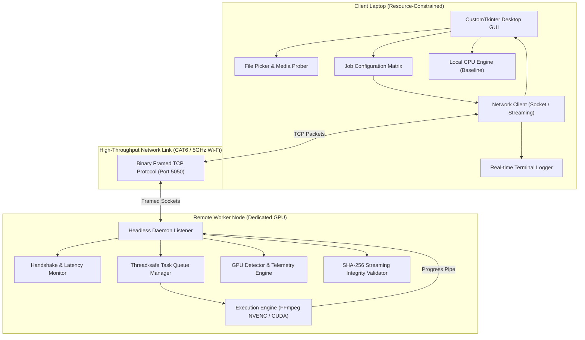
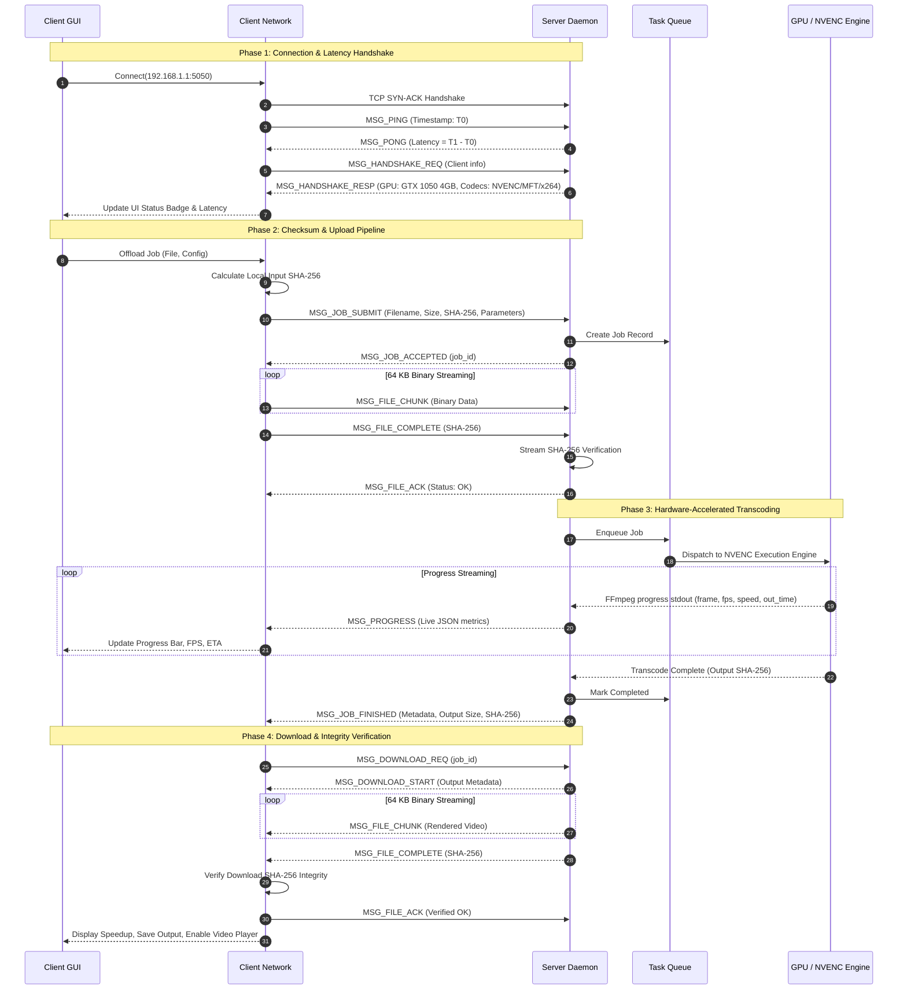

# System Architecture & Technical Specification
**Course**: CSC-334 Parallel and Distributed Computing  
**Project**: Distributed GPU Offloading System

---

## 1. High-Level Architectural Pattern

The system implements an asynchronous **Client-Server Master-Worker Architecture** designed to bridge resource-constrained edge devices (clients) with high-throughput remote computing accelerators (workers).



---

## 2. Framed Binary Network Protocol Layout

To ensure minimal protocol overhead, deterministic packet framing, and zero reliance on heavy web frameworks, the system employs a custom **16-byte fixed-header binary streaming protocol**:

```
 0                   1                   2                   3
 0 1 2 3 4 5 6 7 8 9 0 1 2 3 4 5 6 7 8 9 0 1 2 3 4 5 6 7 8 9 0 1
+-+-+-+-+-+-+-+-+-+-+-+-+-+-+-+-+-+-+-+-+-+-+-+-+-+-+-+-+-+-+-+-+
|                 Magic Identifier: 'DGPO' (4 Bytes)             |
+-+-+-+-+-+-+-+-+-+-+-+-+-+-+-+-+-+-+-+-+-+-+-+-+-+-+-+-+-+-+-+-+
|  Version (1B) |  MsgType (1B) |         Flags (2 Bytes)       |
+-+-+-+-+-+-+-+-+-+-+-+-+-+-+-+-+-+-+-+-+-+-+-+-+-+-+-+-+-+-+-+-+
|                                                               |
+                    Payload Length (8 Bytes uint64)            +
|                                                               |
+-+-+-+-+-+-+-+-+-+-+-+-+-+-+-+-+-+-+-+-+-+-+-+-+-+-+-+-+-+-+-+-+
|                                                               |
+                   Payload (Variable Length)                   +
|                                                               |
+-+-+-+-+-+-+-+-+-+-+-+-+-+-+-+-+-+-+-+-+-+-+-+-+-+-+-+-+-+-+-+-+
```

### Packet Protocol Fields:
- **Magic Identifier** (`4 Bytes`, `b"DGPO"`): Validates network alignment and protects against spurious socket data.
- **Version** (`1 Byte`, `uint8`): Enforces client-server protocol compatibility check.
- **Message Type** (`1 Byte`, `uint8`):
  - `MSG_PING (0x01)`: RTT latency measurement ping.
  - `MSG_PONG (0x02)`: Latency measurement response with server timestamps.
  - `MSG_HANDSHAKE_REQ (0x03)`: Client initiation and metadata.
  - `MSG_HANDSHAKE_RESP (0x04)`: Worker capability manifest (GPU model, VRAM, supported codecs).
  - `MSG_JOB_SUBMIT (0x05)`: Offload job descriptor, input checksum, transcode config.
  - `MSG_JOB_ACCEPTED (0x06)`: Acceptance confirmation with unique `job_id`.
  - `MSG_FILE_CHUNK (0x07)`: 64 KB raw binary chunk streaming.
  - `MSG_FILE_COMPLETE (0x08)`: End-of-file boundary with expected SHA-256.
  - `MSG_FILE_ACK (0x09)`: Verification acknowledgement (success or corruption signal).
  - `MSG_PROGRESS (0x0A)`: Real-time asynchronous metrics (frame, fps, %, speed, bitrate).
  - `MSG_JOB_FINISHED (0x0B)`: GPU processing completion signal and output metadata.
  - `MSG_DOWNLOAD_REQ (0x0C)`: Client request to retrieve rendered output.
  - `MSG_DOWNLOAD_START (0x0D)`: Output payload metadata header.
  - `MSG_ERROR (0x0E)`: Graceful error propagation.
  - `MSG_CANCEL (0x0F)`: Immediate execution termination request.
- **Flags** (`2 Bytes`, `uint16`): Reserved for compression and priority bits.
- **Payload Length** (`8 Bytes`, `uint64`): Exact byte length of the variable payload.

---

## 3. End-to-End Offloading State Machine



---

## 4. Fault-Tolerance & Resilience Mechanisms

1. **In-Flight Data Integrity (SHA-256 End-to-End)**:
   - Input files are hashed before socket transmission. The worker server computes a streaming SHA-256 hash as chunks arrive. If a network corruption occurs, the worker immediately rejects the file (`MSG_FILE_ACK status=error`), purges the temporary file, and requests retransmission.
   - The same validation occurs upon downloading the rendered output back to the client.
2. **Network Timeout & Keepalive Management**:
   - Connection sockets employ `TCP_NODELAY` and strict timeout thresholds:
     - `CONNECT_TIMEOUT`: 5 seconds
     - `PING_TIMEOUT`: 3 seconds
     - `SOCKET_TIMEOUT`: 20 seconds
   - If an unexpected socket disconnection occurs, worker daemon releases GPU execution slots and cleans orphaned files in `server_workspace/`.
3. **Graceful Cancellation**:
   - When the user presses **Cancel**, an immediate `MSG_CANCEL` packet is dispatched. The server worker locates the active FFmpeg PID via `JobRecord.process_handle` and issues `proc.kill()`, freeing GPU VRAM and preventing wasted compute.
4. **Adaptive Fallback Engine**:
   - If a client requests `h264_nvenc` but the worker node has an outdated driver or lacks NVENC hardware, the daemon logs an informative diagnostic warning and falls back to hardware MFT or optimized `libx264` multi-threaded software encoding, guaranteeing 100% pipeline completion.
